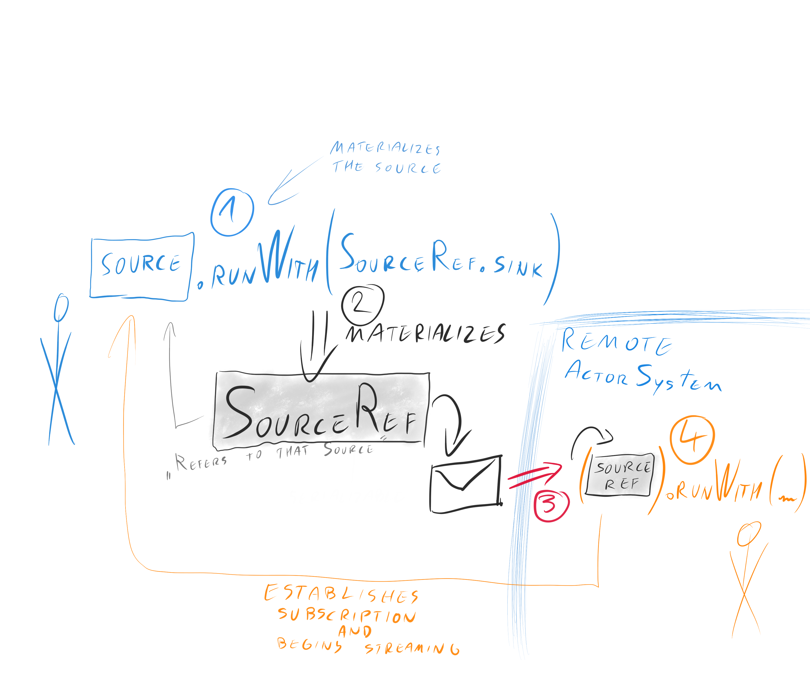
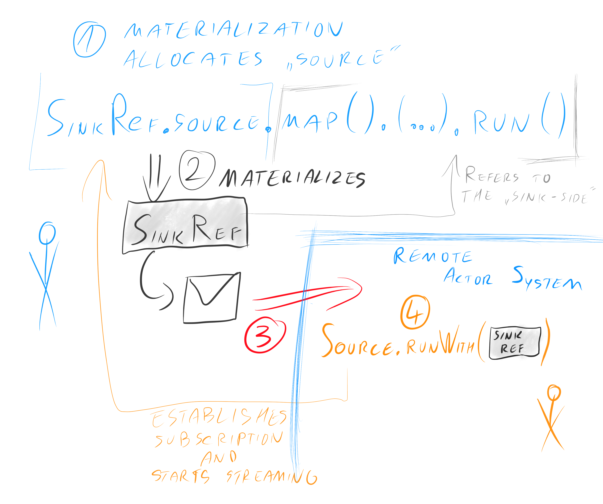

# (Remote) Akka Streams over Network boundaries 

Stream references, or "stream refs" for short, allow running Akka Streams across multiple nodes within 
an Akka Cluster. 

Unlike heavier "streaming data processing" frameworks, Akka Streams do not require running and maintaining
a cluster onto which the streams are later "deployed". Akka Stream Refs are, as the name implies, references
to existing parts of a stream, and can be used to create a distributed processing framework, however they
are not on that level of abstraction by themselves. 
  
They are however trivial to run within existing Akka applications and maintain flow-control / back-pressure,
automatically over the network. They can be seen as a replacement to the "work pulling pattern".  

@@@ note
  A useful way to think about stream refs is: 
  "like an `ActorRef`, but for Akka Streams's `Source` and `Sink`".
  
  Since they refer to an already existing, possibly remote, Sink or Source.
  This is not to be mistaken with deploying streams remotely, which this feature is not intended for.
@@@

Since Akka Streams are an implementation of Reactive Streams, by induction one could also say that
stream refs allow running *Reactive Streams over the network*.

## Stream References

The prime use case for stream refs is to replace raw actor or http messaging in places where a long
running stream of data is expected between two entities. Such can be for example sending work requests
to other nodes, in such way that the work requests do not overwhelm the downstream worker nodes, 
or similar systems.

By using stream refs, you may be able to avoid the need of putting messages through a message queue.

Stream refs are not persistent, however it is simple to build a resumeable stream by introducing such protocol
on the actor messaging layer. It pointing out that, that stream refs are absolutely expected to be sent over
Akka remoting to other nodes within a cluster, and as such, complement and do not compete with plain Actor
messaging. Actors would usually be used to establish the stream, by means of some initial message saying 
"I want to offer you many log elements (the stream ref)", or alternatively in the opposite way "If you need
to send me much data, here is the stream ref you can use to do so".   

Since the two sides ("remote" and "local") of reach reference may be confusing to simply refer to by
"remote" and "local", since either side can be seen as "local" or "remote" depending how we look at it,
we propose to use the terminology "origin" and "target", which is defined by where the stream ref was created.
For `SourceRef`s, the "origin" is the side which has the data that it is going to stream out. For `SinkRef`s
the "origin" side is the actor system that is ready to receive the data and has allocated the ref. Those
two may be seen as duals of each other, however to explain patterns about sharing references, we found this
 wording to be rather useful.  

### Source Refs - offering streaming data over network

A @scala[@scaladoc[`SourceRef`](akka.stream.SourceRef)]@java[@javadoc[`SourceRef`](akka.stream.SourceRef)]
can be offered to a remote actor system in order for it to consume some source of data that we have prepared
locally. 

Scala
:   @@snip [FlowStreamRefsDocSpec.scala]($code$/scala/docs/stream/FlowSourceRefsDocSpec.scala) { #offer-source }

The origin actor which creates and owns the Source could also perform some validation or additional setup
when preparing the source. Once it has handed out the `SourceRef` the remote side can run it like this:

Scala
:   @@snip [FlowStreamRefsDocSpec.scala]($code$/scala/docs/stream/FlowSourceRefsDocSpec.scala) { #offer-source-use }

@@@ warning
  A `SourceRef` is *by design* "single-shot". i.e. it may only be materialized once.
  This is in order to not complicate the mental model what materializing such value would mean.
  
  By being single-shot, we always know what it means, and on top of those semantics offer a fan-out
  by emitting multiple `SourceRef`s which target the same `Source` that uses `Broadcast`.
  This also allows for fine grained control how many streams a system can expect to be running 
  at the same time, which is useful for capacity planning and "allowed number of concurrent streams
  limiting" of clients.
@@@

### Sink Refs - offering to receive streaming data

The dual of source references are A @scala[@scaladoc[`SourceRef`](akka.stream.SinkRef)]@java[@javadoc[`SourceRef`](akka.stream.SinkRef)]s. They can be used to offer the other side the capability to 
send to the *origin* side data in a streaming, flow-controlled fashion. The origin here allocates a Sink,
which could be as simple as a `Sink.foreach` or as advanced as a complex sink which streams the incoming data
into various other systems (e.g. any of the Alpakka provided Sinks).

@@@ note
  To form a good mental model of `SinkRef`s, you can think of them as being similar to "passive mode" in FTP.
@@@

Scala
:   @@snip [FlowStreamRefsDocSpec.scala]($code$/scala/docs/stream/FlowSourceRefsDocSpec.scala) { #offer-sink }

## Bulk Stream References

@@@ warning
  Not yet implemented. See ticket ...... 
@@@

Bulk stream references can be used to create simple to use side-channels to transfer humongous amounts 
of data such as huge log files, messages or even media, with as much ease as if it was a trivial local stream.

Connections for each stream ref bulk stream ref are established independently, and do not utilise
actor messaging (which is not designed for such bulk transfers, but rather small messages).

## Configuration

### Stream reference subscription timeouts

All stream references have a subscription timeout, which is intended to prevent resource leaks
in situations in which a remote node would requests the allocation of many streams yet never actually run
them. In order to prevent this, each stream reference has a default timeout (of 30 seconds), after which
if it's "handed out" side has not been materialized, the origin will terminate with a timeout exception,
and IF the remote side eventually would be run afterwards, it would also immediately fail with an exception
pointing out that the origin seems to be missing.

Since these timeouts are often very different based on the kind of stream offered, and there can be 
many different kinds of them in the same application, it is possible to not only configure this setting
globally (`akka.stream.stream-refs.subscription-timeout`), but also via attributes:

 
:   @@snip [FlowStreamRefsDocSpec.scala]($code$/scala/docs/stream/FlowSourceRefsDocSpec.scala) { #attr-sub-timeout }

## General configuration

Other settings can be set globally, in your `application.conf`, by overriding any of the following values
in the `akka.stream.stream-refs.*` keyspace:

@@snip [reference.conf]($akka$/akka-stream/src/main/resources/reference.conf#stream-refs)
